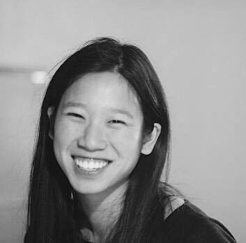

## About Me

Hello! I am a first-year Ph.D. student at [MIT CSAIL](https://www.csail.mit.edu/), working with [David Sontag](http://cs.nyu.edu/~dsontag/) in the [Clinical Machine Learning](http://clinicalml.org/) group. I am president of [Graduate Women in Course 6](http://gw6.scripts.mit.edu/).

Prior to MIT, I worked at [Dropbox](www.dropbox.com) as a Machine Learning Engineer and Data Scientist. I graduated from [Harvard](https://www.seas.harvard.edu/) with a joint AB/SM in Applied Math and Computational Engineering where I researched with [Michael Luca](http://www.hbs.edu/faculty/Pages/profile.aspx?facId=602417) and [Ben Edelman](http://www.hbs.edu/faculty/Pages/profile.aspx?facId=417579).

You can email me at iychen [at] mit [dot] edu

## Research Interests

My research focuses on machine learning and its applications to solving important real-world problems including *healthcare* and *fairness*. In particular, I am curious about *approximation techniques*, *intepretative and useful learning*, and all things related to *graphical models*.

## Projects

Current research projects include

1. **Fairness in machine learning**: how can we provide theoretical bounds on the amount of discrimination in a mechanism through either faulty data or a biased algorithm?
2. **Congestive Heart Failure**: what are the different stages and subtypes of heart failure? Can we identify causal information in observational data? In collaboration with [Beth Israel Deaconess Medical Center](http://www.bidmc.org/).
3. **Health Knowledge Graph**: how can we build a structure to capture causal information on symptoms and diseases? Can we capture and quantify error in the model?

## Teaching

> The more that you read, the more things you will know,  
> the more that you learn, the more places you’ll go

I am passionate about teaching, particularly through expanding access to education. At Harvard, I was awarded the [Derek Bok Center Certificate of Distinction in Teaching](https://bokcenter.harvard.edu/awards) for outstanding teaching evaluations.

I have served as a Teaching Fellow or Course Assistant for the following Harvard classes.

Year | Class Title | Professor
-----|-------|--------
2011 | Linear Algebra and Real Analysis I  | Paul Bamberg
2011 | Microeconomic Theory | Ed Glaeser
2012 | Linear Algebra and Real Analysis II | Paul Bamberg
2012 | Multivariable Calculus | Evelyn Hu, Avi Shapiro
2013 | Differential Equations | Margo Levine, Avi Shapiro
2014 | Algorithms and Data Structures | Michael Mitzenmacher

---

## Website credit

This is based on a [Jekyll](https://jekyllrb.com/) template. You can find the full source code on [GitHub](https://github.com/bk2dcradle/researcher).